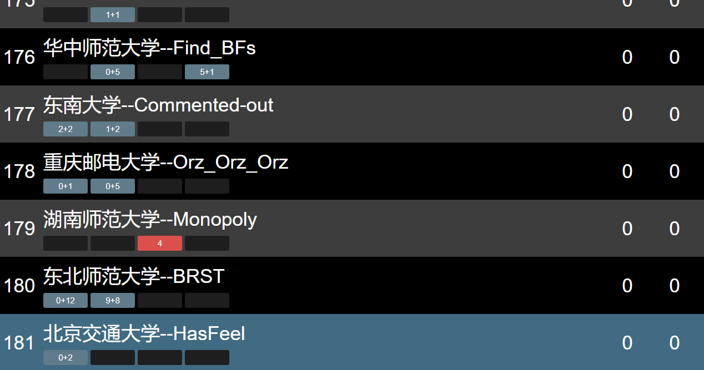

acm-resover
==================
本项目fork自[hiho-resolver](https://github.com/hiho-coder/hiho-resolver)，用于ACM系列竞赛的滚榜。
相比原项目，主要优化了动画效率，更改了界面配色，并丰富了文档。

# 截图



使用教程
------------------------

## 1. 准备数据

HZNUOJ，直接访问contest_sub_log.json.php?cid=xxxx即可获取相应场次的数据。

或者也可以自己构造数据，json的格式在文档末尾。

数据输入的代码在`js/main.js`的最后，`$.getJSON("contest.json", function(data){..})`

默认是使用根目录下的`contest.json`，可以直接把准备好的数据贴到里面去。

## 2. 搭建服务器

1. 网页必须以http协议访问，准备一个能运行php的服务器，Windows推荐用WAMP，MacOS推荐用MAMP。
2. 把整个工程文件拷贝到服务器的目录下，在浏览器中访问index.html即可。

## 3. 操作说明

不停按方向键右即可。

**如果切换了数据源，需要清空浏览器缓存再刷新。**

## 更多配置

封榜的时间默认是3600\*2s（距离比赛开始2小时，用的是一个热身赛的数据，整场比赛只有3小时），在`hiho-resolver.js` 最开头修改

## JSON格式

```
{
  problem_count: 10,
  solutions: {... },
  users: {... }
}
```

solution的格式，key可以任意，problem下标从1开始:

```
381503: {
  user_id: "1",
  problem_index: "1",
  verdict: "AC",
  submitted_seconds: 22
},
381504: {
  user_id: "2",
  problem_index: "1",
  verdict: "WA",
  submitted_seconds: 23
},
```

user的格式，其中key即为user的id，要和solution中对上：

```
1: {
  name: "花落人亡两不知",
  college: "HZNU"
},
2: {
  name: "大斌丶凸(♯｀∧´)凸",
  college: "HDU"
},
3: {
  name: "天才少女队",
  college: "PKU"
},
```

